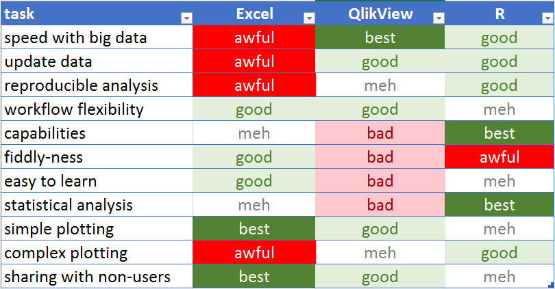

## Jake Tolbert
### Director of Data Services
### Alumni & Development

## R & R Studio

- R - programming language with a focus on statistical analysis
- R Studio - an IDE for R

## Tool Comparison




## Complex Mailing Lists

Use R (or SQL or SAS or some such). 

- Data can change underneath, but criteria can be saved.
- QV has no way to do complex filtering eg:
    - T&D majors around Decatur OR $1000 lifetime gifts to T&D Building

## Pulling A List    
```{r echo=TRUE, eval = FALSE}

# imagine I'm connected to a database with databases:
#   - majors_tbl with pidm, major
#   - regions_tbl with pidm, region
#   - donors_tbl with pidm, td_gifts, athletics_gifts, uc_gifts, scholarship_gifts
#   - demographic_tbl with pidm, mailing address, and more ...

 
# get a list of all Theatre & Dance majors
tdmajors  <- majors_tbl %>% 
  filter( major == 'TD'  ) 

# get a list of everybody around Decatur
arounddecatur  <- regions_tbl %>% 
  filter( region == 'DECATUR' )

# get T&D majors around Decatur
td_around_decatur  <- tdmajors %>% 
  semi_join(arounddecatur, by = 'pidm') %>% 
  distinct(pidm)
```

## Pulling A List (cont.)

```{r echo=TRUE, eval = FALSE}
# get donors who've given $1000+ to Theatre & Dance building
td_donors  <- donors_tbl %>% 
  filter(td_gifts  >= 1000 ) %>% 
  distinct(pidm)

#combine both lists then add mailing data
my_mailing  <- bind_rows( td_around_decatur, td_donors) %>% 
  left_join( 
    demographic_tbl %>% 
        select(pidm, name, address, city, st, zip)
      , by = 'pidm', copy = T
  ) %>% 
  collect()
```


## Exploratory Analysis

- Use QV
  - load data
  - set up list boxes and charts
  - click around


## Statisical Analysis

Use R for complex statistical analysis.

```{r message=FALSE, warning=FALSE, include=FALSE}

knitr::opts_chunk$set(
    cache = T
  , highlight = T
)


library(tidyverse); library(lubridate); library(magrittr)
library(randomForest); library(caret); library(broom)

airlinedata  <- read_csv('data/On_Time_On_Time_Performance_2017_1.csv') %>% 
  mutate( 
      FlightDate = ymd(FlightDate) 
    , Origin = factor(Origin)
    , UniqueCarrier = factor(UniqueCarrier)
  )


set.seed(500)
mydata  <- airlinedata %>% sample_n(5000) %>% 
  replace_na(list( ArrDelayMinutes = 0, ArrDelay = 0))
  
```

## Quick Summary Data
```{r}
summary(airlinedata$DepDelay)
```


## Quick Summary Data 
```{r}
hist(airlinedata$DepDelay)
```

## Quick Summary Data 
```{r}
boxplot(airlinedata$DepDelay ~ airlinedata$UniqueCarrier, ylim = c(-20,50))
```

## More Complex Analytical Tasks

```{r highlight = T}
cor.test(as.numeric(airlinedata$UniqueCarrier), airlinedata$DepDelay)
```

## More Complex Analytical Tasks
```{r highlight = T}
t.test(
    airlinedata %>% filter(Origin == 'ORD') %>% extract2('DepDelay')
  , airlinedata %>% filter(Origin == 'CLT') %>% extract2('DepDelay')
)
```


## Creating a Report for Others

1. Build with R Markdown 
  - integrate Markdown + R into generated html/pdf.
2. Use QV for dashboards, etc.


## Building Statistical Models

```{r echo=T, message=FALSE, warning=FALSE, results = 'hide'}
lm_model <- lm(ArrDelayMinutes ~ DayOfWeek + AirTime, data = mydata)

rf_model <- randomForest(
                 x = mydata %>% select(DayOfWeek, UniqueCarrier)
               , y = mydata$ArrDelayMinutes
             )

caret_model <- train(
                x = mydata %>% select(DayOfWeek, UniqueCarrier)
              , y = mydata$ArrDelayMinutes  
              , trControl = trainControl(number = 3)
              )
```

## Linear Model
```{r}
summary(lm_model)
```

## Random Forest Model
```{r}
rf_model
```

## Caret Model
```{r}
caret_model
```

## Predict New Cases

```{r}
newdata  <- data_frame(
    DayOfWeek      = c(1L,2L,3L,4L,5L)
  , UniqueCarrier  = factor(
                        c("AA", "AS", "EV", "WN", "OO")
                      , levels = levels(mydata$UniqueCarrier)
                    )
)
predictions  <- predict(caret_model, newdata)
newdata$predictedDelay  <- predictions
newdata
```


## Use the Tidyverse

- a series of packages creating a new grammar for R
- packages include
  - dplyr
  - ggplot2
  - tidyr
  - the pipe

## Base R - Use Nested Functions
```{r echo=TRUE, eval = FALSE, highlight = TRUE}
bop(
  scoop(
    hop(foo_foo, through = forest),
    up = field_mice
  ), 
  on = head
)
```


## Lots of Little Steps, Saving New Objects
```{r echo=TRUE, eval = FALSE, highlight = TRUE}
foo_foo_1 <- hop(  foo_foo  , through = forest)
foo_foo_2 <- scoop(foo_foo_1, up = field_mice)
foo_foo_3 <- bop(  foo_foo_2, on = head)
```


## Lots of Little Steps, Overwriting Each Time
```{r echo=TRUE, eval = FALSE, highlight = TRUE}
foo_foo <- hop(  foo_foo, through = forest)
foo_foo <- scoop(foo_foo, up = field_mice)
foo_foo <- bop(  foo_foo, on = head)
```


## Use the Pipe
```{r echo=TRUE, eval = FALSE, highlight = TRUE}
foo_foo %>%
  hop(through = forest) %>%
  scoop(up = field_mouse) %>%
  bop(on = head)
```


## Dplyr's Verbs
```{r}

airlinedata %>% 
  mutate(
      DepTime = as.numeric(DepTime)
    , DepMorning = ifelse(DepTime < 12, "morning", "evening")
  ) %>% 
  filter(Origin == 'ORD' | Origin == 'MIA') %>% 
  select(Origin, DayOfWeek,FlightDate,ArrDelay, DepDelay, AirlineID) %>% 
  arrange(DepDelay)
```

## Pivot Table Verbs
```{r}
  airlinedata %>% 
  group_by(AirlineID) %>% 
  summarize(
      n_flights    = n()
    , mean_delay   = mean(ArrDelay, na.rm = T)
    , median_delay = median(ArrDelay, na.rm = T)
  )
```


## Fancy Plotting - Dates vs. Arrival Delay

```{r message =F, warning = F, error = F }
ggplot(mydata, aes(x = FlightDate, y = ArrDelayMinutes)) + 
  geom_point(aes(color = Carrier)) + 
  geom_smooth() 
```

## Fancy Plotting-  Dates vs. Arrival Delay

```{r message =F, warning = F, error = F }
ggplot(mydata, aes(x = FlightDate, y = ArrDelayMinutes)) + 
  geom_jitter(alpha = .5, aes(color = Carrier)) + 
  geom_smooth() + 
  coord_cartesian(ylim = c(0,100))
```


## Fancy Plotting-  Dates vs. Arrival Delay

```{r message =F, warning = F, error = F }
ggplot(mydata, aes(x = FlightDate, y = ArrDelayMinutes)) + 
  geom_jitter(alpha = .5, aes(color = Carrier)) + 
  geom_smooth() + 
  coord_cartesian(ylim = c(0,100)) + 
  facet_wrap(~Carrier)
```