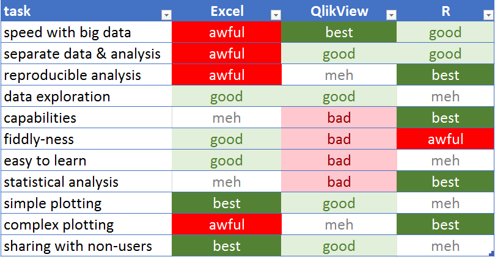

## A Look at Data Analysis Tools
### or Why You Should Learn R
#### Jake Tolbert
##### Director of Data Services
##### Millikin University

## What We'll Look At Today

1. A comparison of data analysis tools
2. Using the right tool for the job
3. And since the Right Tools is R, the basics of R

## Tool Comparison




## When The Job Is: Creating Complex Mailing Lists

Use R (or SQL or SAS or some such). 

- Data can change underneath, but criteria can be saved.
- QV/Tableau has no way to do complex filtering eg:
    - Theatre majors around Decatur OR $1000 lifetime gifts to Theatre Building

## Pulling A List in R  
```{r echo=TRUE, eval = FALSE}

# imagine I'm connected to a database with databases:
#   - majors_tbl with pidm, major
#   - regions_tbl with pidm, region
#   - donors_tbl with pidm, td_gifts, athletics_gifts, uc_gifts, scholarship_gifts
#   - demographic_tbl with pidm, mailing address, and more ...

 
# get a list of all Theatre & Dance majors
tdmajors  <- majors_tbl %>% 
  filter( major == 'TD'  ) 

# get a list of everybody around Decatur
arounddecatur  <- regions_tbl %>% 
  filter( region == 'DECATUR' )

# get T&D majors around Decatur
td_around_decatur  <- tdmajors %>% 
  semi_join(arounddecatur, by = 'pidm') %>% 
  distinct(pidm)
```

## Pulling A List (cont.)

```{r echo=TRUE, eval = FALSE}
# get donors who've given $1000+ to Theatre & Dance building
td_donors  <- donors_tbl %>% 
  filter(td_gifts  >= 1000 ) %>% 
  distinct(pidm)

#combine both lists then add mailing data
my_mailing  <- bind_rows( td_around_decatur, td_donors) %>% 
  left_join( 
    demographic_tbl %>% 
        select(pidm, name, address, city, st, zip)
      , by = 'pidm', copy = T
  ) %>% 
  collect()

```


##  When The Job Is: Exploratory Analysis

- Use QV
  - load data
  - set up list boxes and charts
  - click around
- Use Excel
  - click around
  - run some pivot tables
- R requires a mental model
  - read data in
  - print snippets of the data, use summary stats, environment pane
  - `View(airlinedata)`
  - `glimpse(airlinedata)`


##  When The Job Is: Creating a Report for Others

1. Build with R Markdown 
    - integrate Markdown + R into generated html/pdf.
2. Use QV for dashboards, etc. 
3. Dump to Excel and format


## Statisical Analysis

Use R for complex statistical analysis.

```{r message=FALSE, warning=FALSE, include=FALSE}

knitr::opts_chunk$set(
    cache = T
  , highlight = T
)


library(tidyverse); library(lubridate); library(magrittr)
library(randomForest); library(caret); library(broom)

donordata <- read.csv('data/donor-data.csv')  %>% 
  mutate(
      gender = factor(gender)
    , marital_status = factor(marital_status)
    , capacity_rating = str_remove_all(wealth_rating, "\\$|,") %>% str_remove("-.*") %>% as.numeric()
  )


  
```

## Quick Summary Data
```{r}
summary(donordata$age)
```


## Quick Summary Data 
```{r}
hist(donordata$age)
```

## Quick Summary Data 
```{r}
boxplot(donordata$totalgiving ~ donordata$gender, ylim = c(0,600) )
```

## More Complex Analytical Tasks

```{r highlight = T}
cor.test(donordata$currfygiving, donordata$prevfy1giving)
```

## More Complex Analytical Tasks
```{r highlight = T}
t.test(
    donordata %>% filter(marital_status == 'Married') %>% pull(totalgiving)
  , donordata %>% filter(marital_status != 'Married') %>% pull(totalgiving)
)
```


## When The Job Is: Building Statistical Models

Use R. It's the best.

```{r echo=T, message=FALSE, warning=FALSE, results = 'hide'}
lm_model <- lm(prevfy1giving ~ prevfy2giving + pref_address_type, data = donordata)

rf_model <- randomForest(
                 x = donordata %>% select(prevfy2giving, pref_address_type)
               , y = donordata$prevfy1giving
             )

caret_model <- train(
                x = donordata %>% select(prevfy2giving, pref_address_type)
              , y = donordata$prevfy1giving 
              , trControl = trainControl(number = 3)
              )
```

## Build New Data to Predict New Cases

```{r message=FALSE, warning=FALSE}
newdata  <- donordata %>% 
  select(
      prevfy2giving = prevfy1giving
    , pref_address_type
    , currfygiving
  )


newdata
```

## Predict New Cases 
```{r}
lmpredictions     <- predict(lm_model, newdata)
rfpredictions     <- predict(rf_model, newdata)
caretpredictions  <- predict(caret_model, newdata)

newdata$lmGifts   <- lmpredictions
newdata$rfGifts   <- rfpredictions
newdata$caGifts   <- caretpredictions

newdata %>% 
  select(currfygiving, lmGifts, rfGifts, caGifts)
```


## Using R

- begin in an interactive environment
- slide gradually into programming 


## Use the Tidyverse
- a series of libraries with an opinionated way about how you should work in R
- a library (or package) is an optional set of commands written by someone else
  - usually each package is written to do specific thing
  


## Load Packages in Every Script
My scripts almost always begin like this:

```{r echo = T, eval = FALSE, highlight = TRUE}
# libraries -------------------------------------------

library(tidyverse)
library(magrittr)
library(lubridate)
library(readxl)
library(muadc)
library(fundRaising)

# now do actual real work ----------------------------


```


## Base R - Use Nested Functions

```{r echo=TRUE, eval = FALSE, highlight = TRUE}
fullstory  <- bop(
  scoop(
    hop(foo_foo, through = forest),
    up = field_mice
  ), 
  on = head
)
```
- really hard to read
- nobody thinks this way (so it's hard to write this way)

## Lots of Little Steps, Saving New Objects
```{r echo=TRUE, eval = FALSE, highlight = TRUE}
foo_foo_1 <- hop(  foo_foo  , through = forest)
foo_foo_2 <- scoop(foo_foo_1, up = field_mice)
fullstory <- bop(  foo_foo_2, on = head)
```

- not terrible
- but terribly messy


## Lots of Little Steps, Overwriting Each Time
```{r echo=TRUE, eval = FALSE, highlight = TRUE}
foo_foo   <- hop(  foo_foo, through = forest)
foo_foo   <- scoop(foo_foo, up = field_mice)
foo_foo   <- bop(  foo_foo, on = head)
fullstory <- foo_foo 
```

- even better
- but debugging `scoop()` is a royal pain 
- and if the original foo_foo was a 200MB csv, you'll have to read it in again

## Use the Pipe
```{r echo=TRUE, eval = FALSE, highlight = TRUE}
fullstory  <- foo_foo %>%
  hop(through = forest) %>%
  scoop(up = field_mouse) %>%
  bop(on = head)
```

- reads the way it happens
- not messy
- simple to debug 

## Dplyr's Verbs
```{r}

donordata %>% 
  mutate(last2yrsgiving = prevfy1giving + prevfy2giving) %>% 
  filter(alumnus_ind | totalgiving > 1000 ) %>% 
  select(id, totalgiving, last2yrsgiving, alumnus_ind) %>% 
  arrange(totalgiving)
```

Google for "dplyr vignette" for an even better description.


## Pivot Table Verbs
```{r}
donordata %>% 
  group_by(alumnus_ind) %>% 
  summarize(
      n_people = n()
    , mean_giving   = mean(totalgiving, na.rm = T)
    , median_giving = median(totalgiving, na.rm = T)
  )
```

## Fancy Plotting - Contact Reports
```{r message =F, warning = F, error = F }
fundRaising::contact_data %>% 
  count(contactmonth = month(mdy(Date))) %>% 
  ggplot(aes(x = contactmonth)) + 
    geom_line(aes(y = n))
```

## Fancy Plotting - Contact Reports by Staff Member

```{r message =F, warning = F, error = F }
fundRaising::contact_data %>% 
  count(contactmonth = month(mdy(Date)), `Staff Name`) %>% 
  ggplot(aes(x = contactmonth, fill = `Staff Name`)) +
    geom_col(aes(y = n))
```

## Fancy Plotting - Contat Reports by Staff Member

```{r message =F, warning = F, error = F }
fundRaising::contact_data %>% 
  count(contactmonth = month(mdy(Date)), `Staff Name`) %>% 
  ggplot(aes(x = contactmonth, fill = `Staff Name`)) +
    geom_col(aes(y = n)) + 
    facet_wrap(~`Staff Name`)
```


## Lots More Code Examples on Github

- https://github.com/crazybilly/airline-is470-class
  - clone the repo to your desktop and open airline-project.Rproj
- documentation in Rmd/html files
- code examples in R files
- https://github.com/crazybilly/fundRaising
  - an R package designed for fundraising analytics
  - data sets are available from this repo
